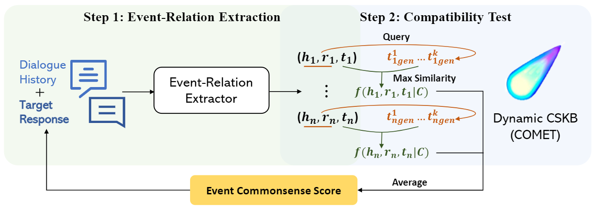

# ACCENT: An Automatic Event Commonsense Evaluation Metric for Open-Domain Dialogue Systems

This repository contains the code, models, and datasets for our paper ACCENT: An Automatic Event Commonsense Evaluation
Metric for Open-Domain Dialogue Systems.

## Quick Links
- [Overview](#overview)
- [Requirements](#requirements)
- [Datasets](#datasets)
- [Experiments](#experiments)
  - [Commonsense Evaluation Metric](#commonsense-evaluation-metric)
  - [Event-Relation Extraction](#event-relation-extraction)
  - [CSKB Population](#cskb-population)

## Overview



We present ACCENT, an event commonsense evaluation metric empowered by commonsense knowledge base ATOMIC. ACCENT uses
event-relation tuples as the symbolic intermediate representation and consists of two components:

1. Event-relation extraction model which extracts event-relation tuples from the target response and its dialogue
   history.
2. Compatibility test method which scores each tuple by checking its compatibility against the knowledge base.

## Requirements

You can install the required packages through

```shell
pip install -r requirements.txt
```

## Datasets

We construct the first publicly available event commonsense evaluation dataset for open-domain dialogues. The dialogue
histories in [DECO](./data/deco) (Dialogue Event COmmonsense dataset) are from human-human dialogues; the dialogue
histories in [ConTurE Subset](./data/conture) are from human-machine dialogues.

The dataset is arranged in JSON format and each sample follows the following format:

```
{
  'history': 4 utterances separated with '</UTT>',
  'response': target response,
  'event_cs_raw': [annotation1, annotation2, annotation3],
  'event_cs': final labelfor event commonsense score obtained by average aggregation
}
```

We further request annotators to thoroughly annotate event-relation tuples for DECO test set, the tuples for each sample
is divided by relation:

```
'tuples':
    {
        rel1: [(head, rel1, tail, 'single' / 'pair'), ... ],
        ...
        rel12: [(head, rel1, tail, 'single' / 'pair'), ... ]
    }
```

## Experiments

### Commonsense Evaluation Metric

ACCENT consists of an [event-relation extraction model](https://huggingface.co/EchoShao8899/t5_event_relation_extractor)
and
a [compatibility test model](https://storage.googleapis.com/ai2-mosaic-public/projects/mosaic-kgs/comet-atomic_2020_BART.zip)
. To download the models, run `cd models; bash download_model.sh`.

To test our metric on DECO test set and ConTurE Subset, run the following commands:

```shell
# DECO
python -m metric.pipeline --verbose \
  --data_dir data/deco/deco_test.json \
  --saved_tuple_path deco_extracted_tuples.csv \
  --evt_model_dir EchoShao8899/t5_event_relation_extractor \
  --comet_dir models/comet-atomic_2020_BART \
  --embedder 'sentence_bert' or 'simcse'

# ConTurE Subset
python -m metric.pipeline --verbose \
  --data_dir data/conture/conture_subset.json \
  --saved_tuple_path conture_extracted_tuples.csv \
  --evt_model_dir EchoShao8899/t5_event_relation_extractor \
  --comet_dir models/comet-atomic_2020_BART \
  --embedder 'sentence_bert' or 'simcse'
```

**Use ACCENT to evaluate your own dialogues**

We provide the following two ways to use ACCENT on your own dialogues:
1. Formulate your own dataset into JSON format following DECO and ConTurE Subset.
    ```
    [{
      'history': 4 utteraces separated with '</UTT>',
      'response': target response,
      'event_cs': ground truth score (optional)
    }, ...]
    ```
   Run the following command:
    ```shell
    python -m metric.pipleine --verbose \
      --data_dir {your own data dir} \
      --saved_tuple_path {saved results path} \
      --evt_model_dir EchoShao8899/t5_event_relation_extractor \
      --comet_dir models/comet-atomic_2020_BART \
      --embedder 'sentence_bert' or 'simcse'
    ```
2. Check the following code snippet to use ACCENT and interpret its score:
    ```python
    from metric.accent import ACCENT
    
    metric = ACCENT(
        comet_dir='models/comet-atomic_2020_BART', 
        evt_model_dir='EchoShao8899/t5_event_relation_extractor',
        use_gpu=True,
        embedder='sentence_bert'
    )
    
    history = "{utt1}</UTT>{utt2}</UTT>{utt3}</UTT>{utt4}</UTT>"  # Dialogue history with 4 previous utterances.
    target = "target response to evaluate"
    
    score, tuples, cs_tails, tuple_scores = metric.score(history, target, verbose_mode=True)
    
    print(f'Score: {score}')
    
    if len(tuples) > 0:
        print('Break-down results:')
        tuples = [f'({t[0]}, {t[1]}, {t[2]})' for t in tuples]
        d = max([len(t) for t in tuples])
        for t, s in zip(tuples, tuple_scores):
            print(t.ljust(d), ':', s)
    ```

**Train your own event-relation extractor**

We train the event-relation extractor using the human-extracted tuples for DECO training set and some manually selected
negative samples. You can follow [scripts/train_event_relation_extractor.sh](scripts/train_event_relation_extractor.sh)
to train the model with your own data.

**Baselines**

In this repository, we also include the implementation of some baseline metrics, including FED, Cross-encoder, and MLP
Regressor. You can find them in [metric](./metric).

### Event-Relation Extraction

We conduct additional experiments to thoroughly examine the event-relation extraction part of ACCENT (Table 3 in the
paper).

To test the event-relation extraction part of ACCENT, run the following command (See the commands above to find how to
get `deco_extracted_tuples.csv`):

```shell
python -m eventualization.evt_evaluate \
    --ground_truth_path data/deco/deco_test.json \
    --saved_tuple_path outputs/deco_extracted_tuples.csv
```

**Baselines**

We also provide the implementation of two baseline methods for the event-relation extraction part.

- Baseline 1: ASER Extractor

  Before you run the extractor, you need to train the relation classifiers. Run the following command:
    ```shell
    python -m eventualization.train_lstm_relation_classifier \
        --data_dir data/deco/deco_train.json \
        --epoch 50 --model_dir models/aser_classifiers
    ```

  Then run the following command to extract tuples for DECO test set:
    ```shell
    python -m eventualization.aser_runner \
        --stanfordnlp_dir {Stanford core NLP toolkit dir} \
        --data_dir data/deco/deco_test.json \
        --saved_tuple_path outputs/aser_extraction_result.csv
    ```
- Baseline 2: ATOMIC search

  Run the following command to get the result:
    ```shell
    python -m eventualization.one_hop_search \
        --data_dir data/deco/deco_test.json \
        --saved_tuple_path outputs/one_hop_search_result.csv
    ```

### CSKB Population

The compatibility test approach in ACCENT also outperforms baseline methods for the CSKB Population task (Table 4 in the
paper). We use the CSKB population benchmark provided
in [the EMNLP'21 paper](https://aclanthology.org/2021.emnlp-main.705.pdf). The benchmark training set can be
found [here](https://www.kaggle.com/datasets/tianqingfang/ckbp-emnlp2021) and the test set can be
found [here](https://github.com/HKUST-KnowComp/CSKB-Population/blob/main/data/evaluation_set.csv). Please download them
to [data](./data) before you run the code for CSKB Population.

Run the following command to evaluate our method on the test set.

```shell
bash train_cskb_population_comet.sh
python population/evaluate_cskb_my_comet.py \
  --comet_dir models/my_cskb_population_comet \
  --evaluation_file_path data/evaluation_set.csv
  ```

**Baselines**

We include the implementation of Bert and KG-Bert as the CSKB Population baselines. Please look
at [scripts/train_bert.sh](scripts/train_bert.sh) and [scripts/train_kgbert.sh](scripts/train_kgbert.sh) to evaluate
them.

## Bugs or Questions

If you have any questions related to the code, the data, or the paper, feel free to email [Sarik](mailto:sarik@isi.edu)
or [Yijia](mailto:shaoyj@pku.edu.cn). If you encounter any problem when using the code, you can also open an issue to
describe your problem.
